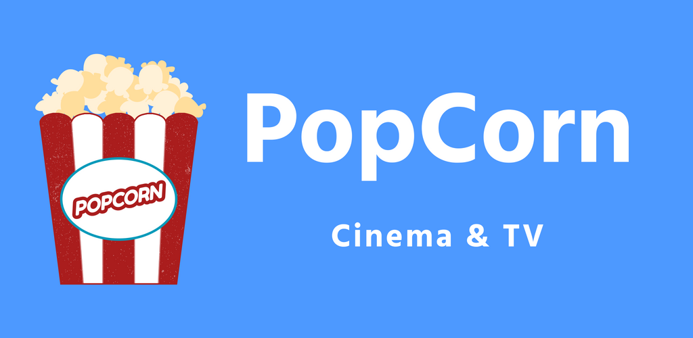

# PopCorn - Cinema & TV

No PopCorn está disponível informações sobre filmes e séries de TV, como o ano de lançamento, tempo de filme, resumo geral sobre o filme, filmes relacionados, elenco, etc.
Os filmes e séries são divididos em três categorias: "Populares" , "Melhores avaliados" e "Lançamentos/ Novos episódios".

Toda a base de dados usada nesta aplicação é fornecida pela API The Movie Database (TMDb). 
Para mais informações: https://www.themoviedb.org/documentation/api

Information on movies and TV series is available at PopCorn, such as the year of release, movie time, general movie summary, related movies, cast, etc.
The films and tv shows are divided into three categories: "Popular", "Top rated" and "Now playing/Today's Show".

The entire database used in this documentation is provided by The Movie Database API (TMDb). 
For more information: https://www.themoviedb.org/documentation/api

-----
###### Padrão de projeto utilizado (Used design pattern)

Para este projeto foi utilizado o padrão de projeto MVP (Model-View-Presenter), de modo que para cada View existe um Presenter correspondente que se comunica com a camada Model, isolando assim as camadas View e Model e estabelecendo uma clara separação de responsabilidades.

For this project we used the MVP (Model-View-Presenter) design pattern, where for each View there is a corresponding Presenter that communicates with the Model layer, thus isolating the View and Model layers and establishing a clear separation of responsibilities.

-----
###### Dependências utilizadas (Used dependencies)

+ Retrofit
+ Gson
+ Dagger
+ Glide
+ Circle ImageView
